# 05 — Activity flows (what the player does)

These are Mermaid activity diagrams. Nodes name **screens** (`screen:id`, matching `ui/screens.json` and [04](04-WIREFRAMES.md)) and **decisions** (diamonds). Tuning values appear as **data keys**, never as numbers. Every node has an exit. A pause is reachable from every run screen through AF-12.

Revision 2 applies the findings of the four sub-agent reviews ([07](07-DIAGRAM-REVIEW.md)). The rules parity items were checked against `D:\repos\AshenSpire\src` with file and line evidence.

Conventions:
- `([...])` is a start or end.
- `[...]` is an activity or screen.
- `{...}` is a decision.
- `[[...]]` is a sub-flow drawn in another diagram.

---

## AF-01 Boot → Title

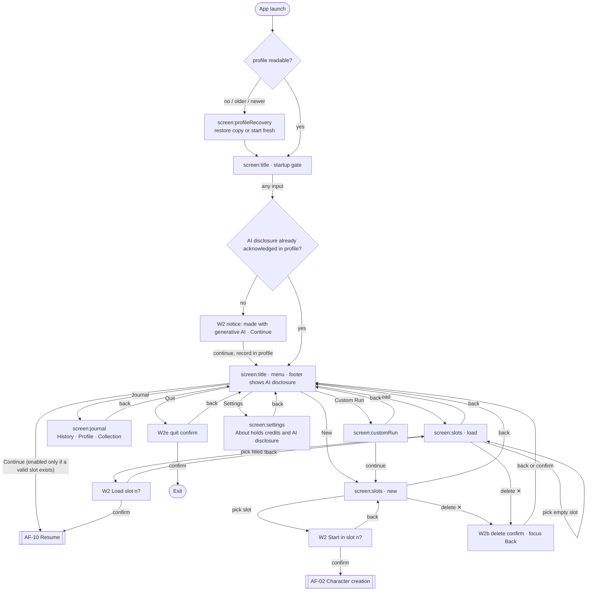

## AF-02 Character creation (screen:creation, W1c rail)

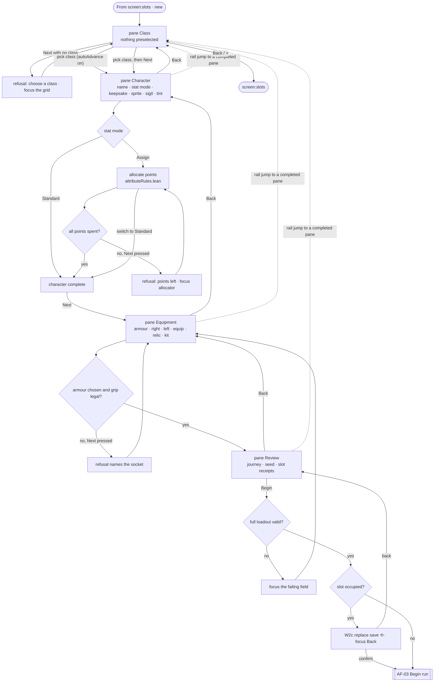

## AF-03 Begin run → Prologue → first map

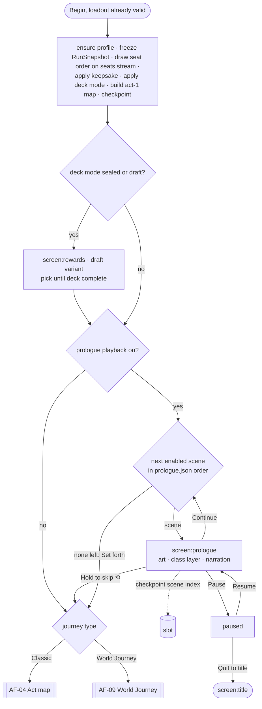

## AF-04 Classic Climb act loop

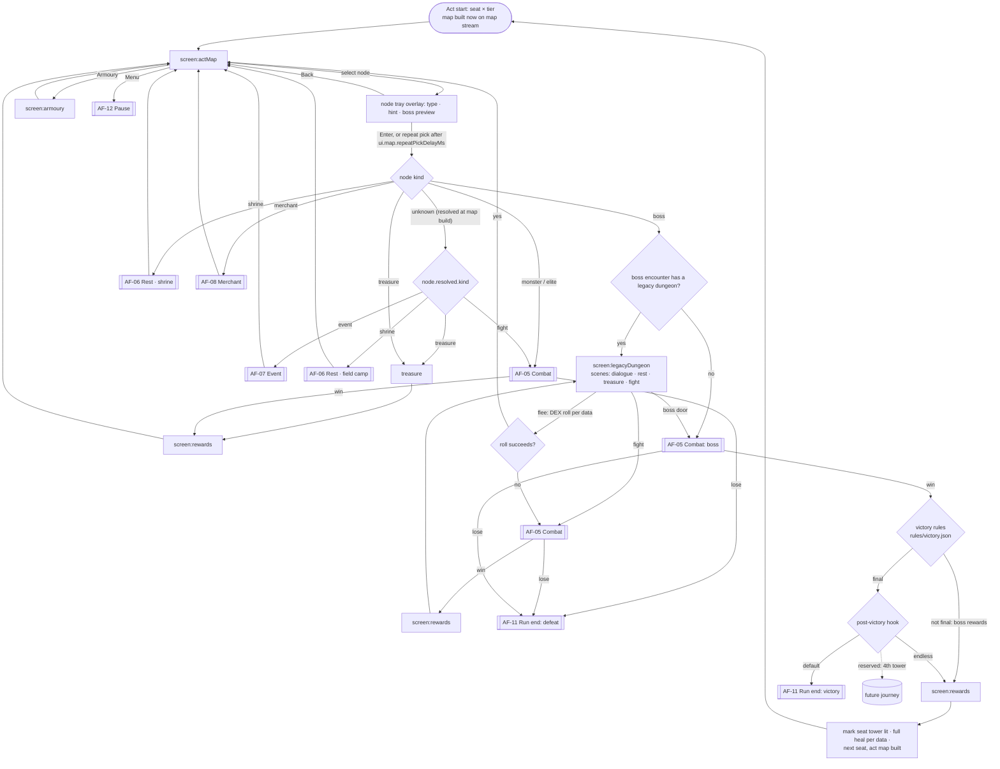

The Blighted Valkyrie causeway needs no special node. At the final tier, the boss pool is the seat's boss rows plus the one boss row that has no seat (PF-07).

## AF-05 Combat turn (screen:combat)

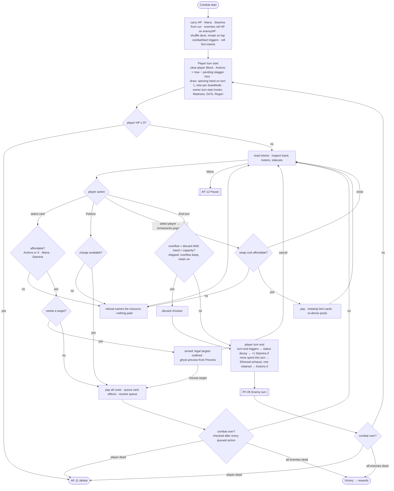

## AF-06 Rest place (screen:rest)

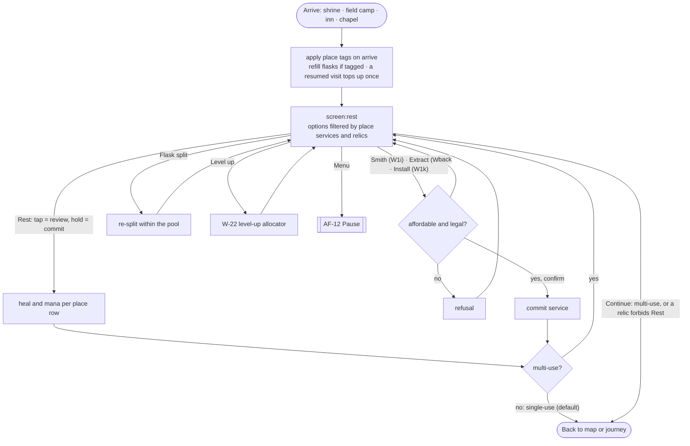

- **Shipped behaviour kept:** at a single-use place, the first committed Rest, Smith, Extract or Install ends the visit.
- **Validator rule:** every place row must yield at least one exit option, so a visit can never softlock.

## AF-07 Event (screen:event)

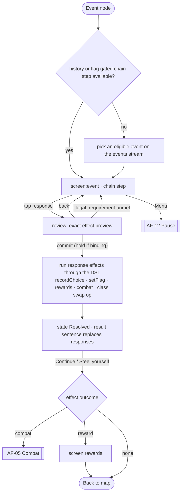

- **Validator rule:** every event has at least one response with no requirement (the always-legal leave).
- The class-swap op is legal only in the event that the data flags (Turncoat Mirror).

## AF-08 Merchant (screen:merchant)

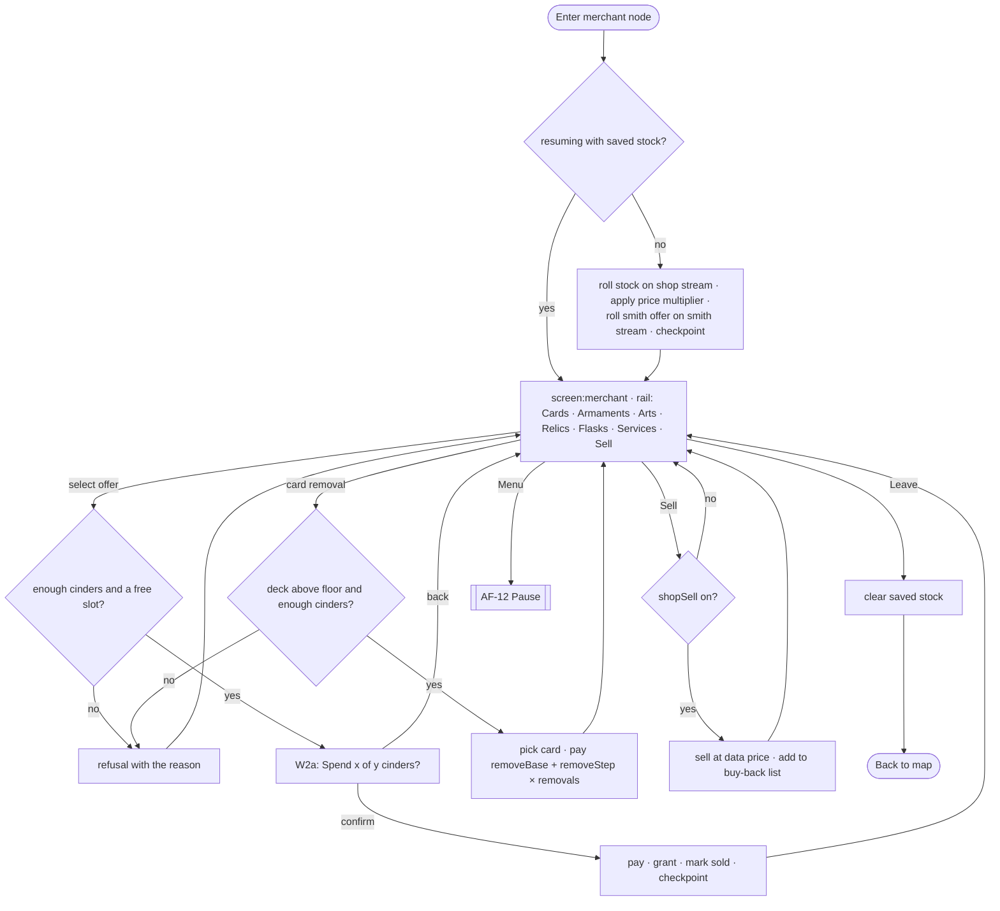

## AF-09 World Journey (P1)

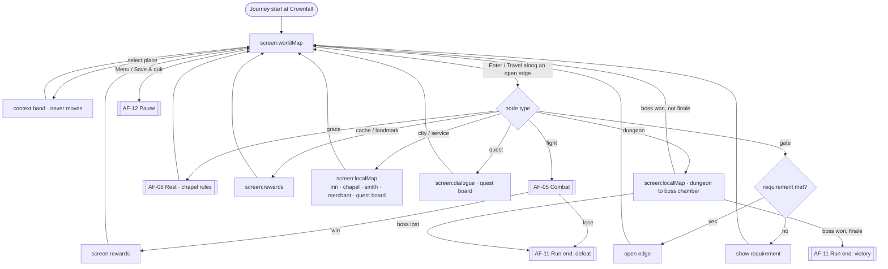

## AF-10 Resume

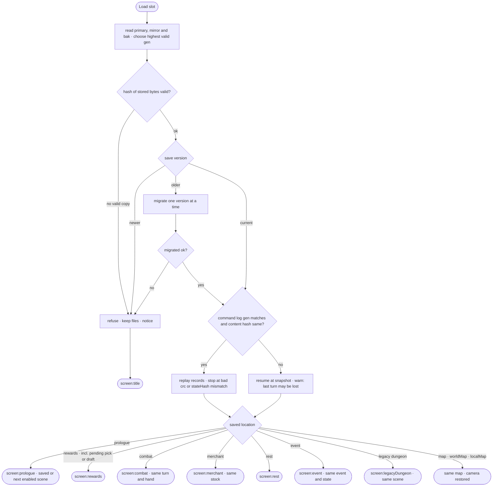

## AF-11 Run end

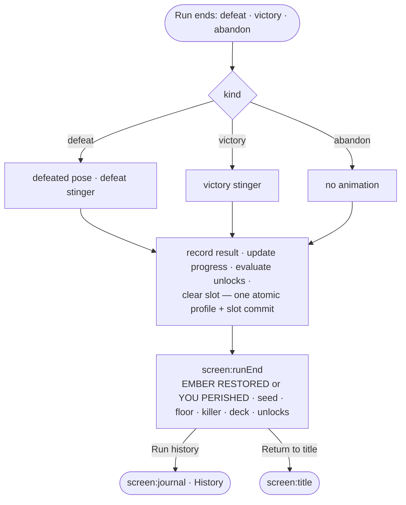

## AF-12 Pause (from any run screen)

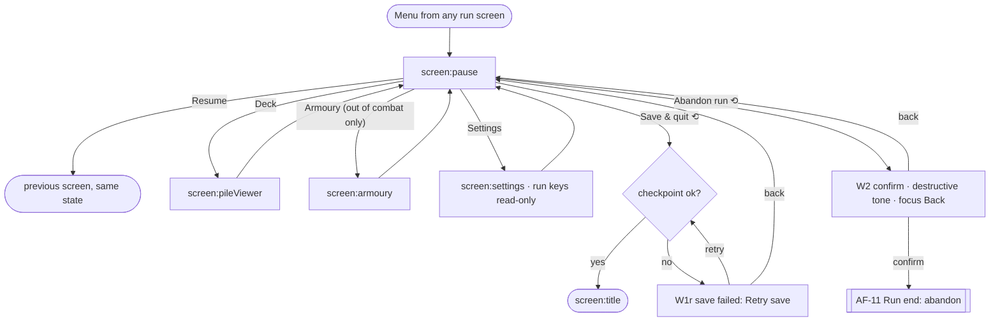
