# 06 — Process flows (what the system does)

These are system-side flows. The actors are the layers **Content**, **Domain**, **Application**, **Presentation** and **Platform** ([08 §2](08-DATA-CONVENTIONS.md)).

This is revision 2, which applies the architecture and rules-parity reviews ([07](07-DIAGRAM-REVIEW.md)). The combat and run-generation flows mirror the shipped engine (`D:\repos\AshenSpire\src\engine\combat.js`, `actions.js`, `triggers.js`, `mapgen.js`, `actmap.js`) as the rules-parity review verified it. The parity oracle (PF-10) proves the C# matches.

---

## PF-01 Asset pipeline (editor or batchmode, before anything else)

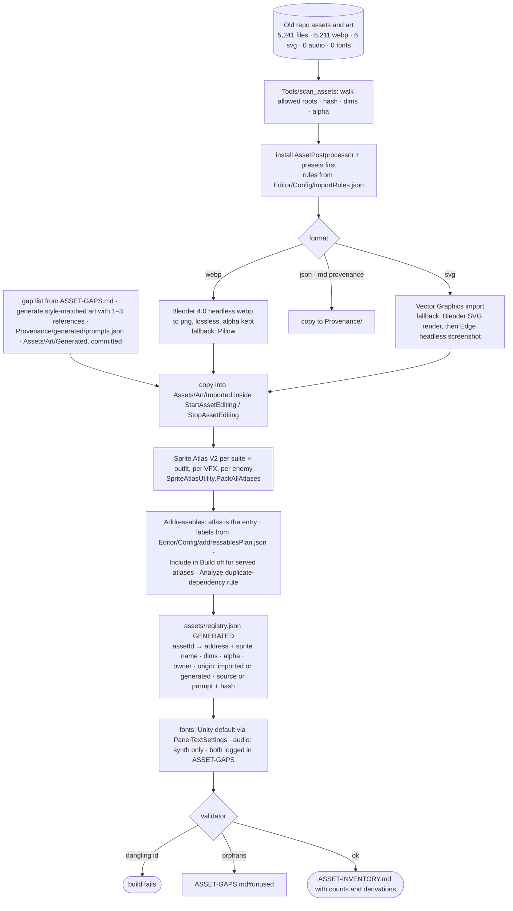

## PF-02 Content load and config layering (boot)

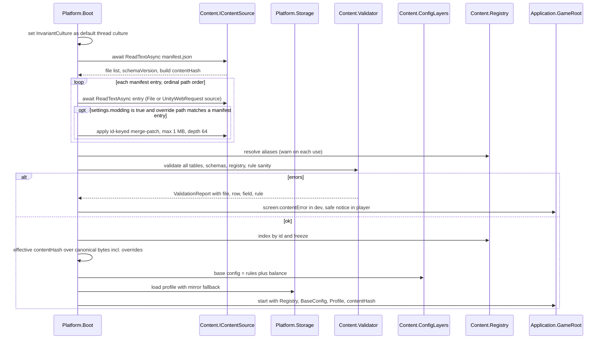

## PF-03 Command → resolve → events → view (every gameplay action)

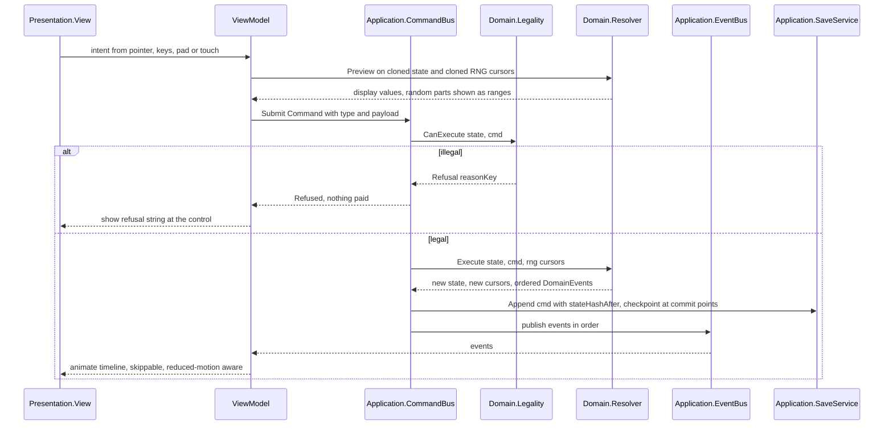

## PF-04 Card play resolution (the shipped queue semantics)

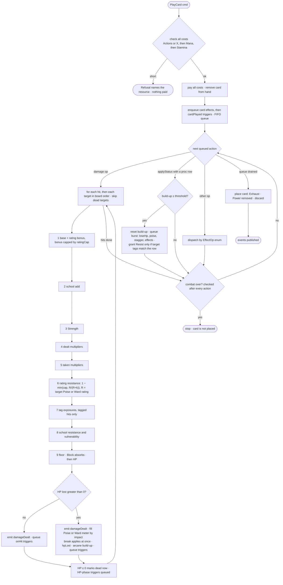

All multipliers, caps, `k`, impact bands and thresholds come from `rules/damage.json`, `rules/meters.json` and the status rows. Previews run the same path on a clone.

## PF-05 Enemy turn and intent selection

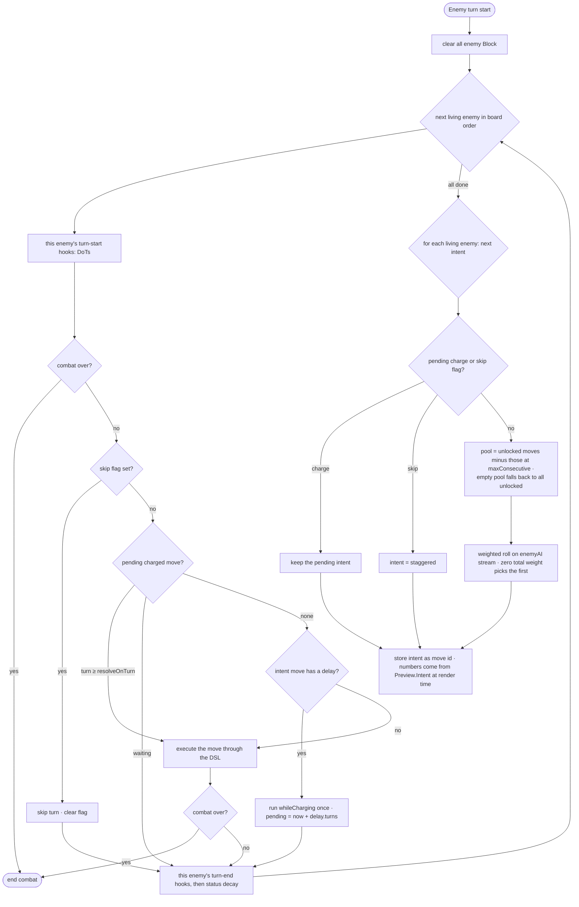

- `firstMove` is used only by the combat-start roll.
- HP phases are **not** looked up here. They fire when HP changes, once each, and queue effects such as unlocking a move.

## PF-06 Save, checkpoint and resume

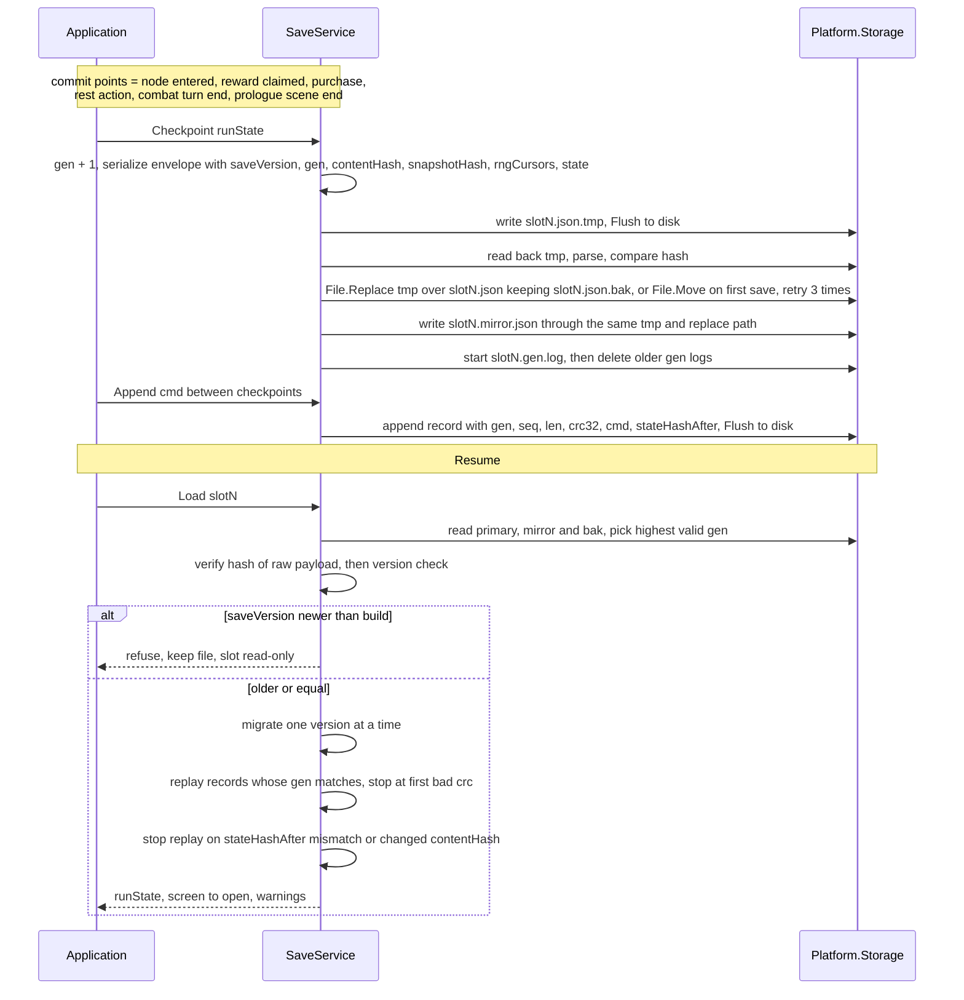

## PF-07 Run generation (Classic Climb)

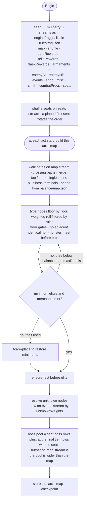

- Legacy dungeons are **not** attached here. Entering a boss node whose encounter carries a dungeon swaps the fight for the dungeon (AF-04).
- The shipped value of `maxRerolls` is 40.

## PF-08 Presentation pipeline (screen composition)

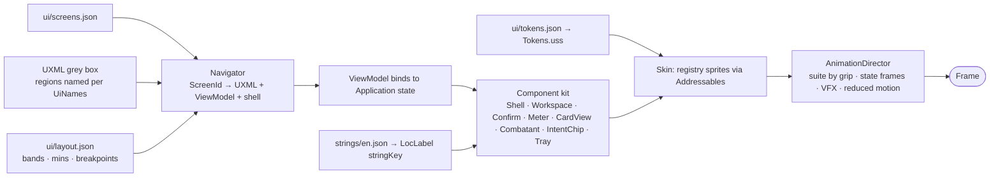

## PF-09 Validation gate (in-session self-gate)

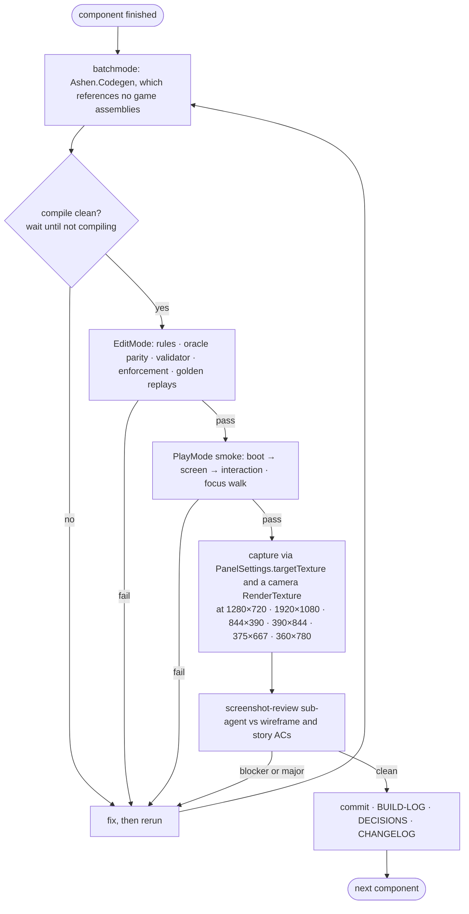

## PF-10 Content export and parity oracle (new)

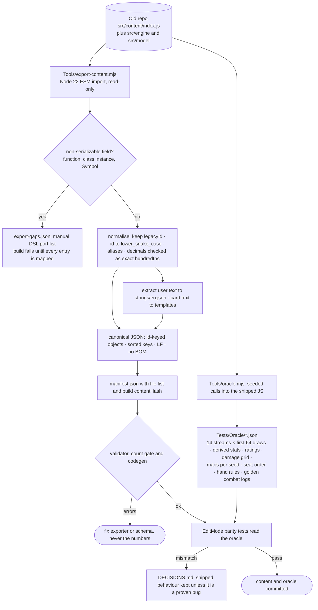

## PF-11 Windows player build (new)

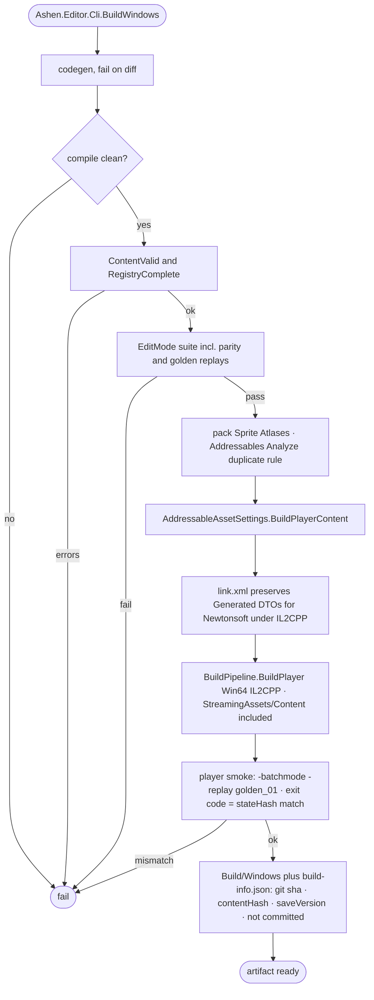

## PF-12 Audio: generated tracks with a procedural fallback (new)

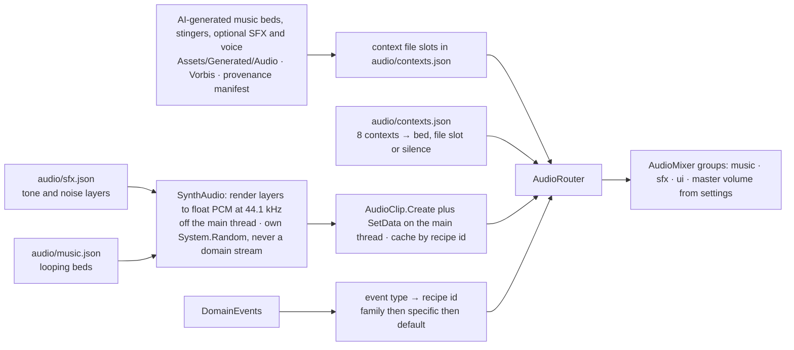
